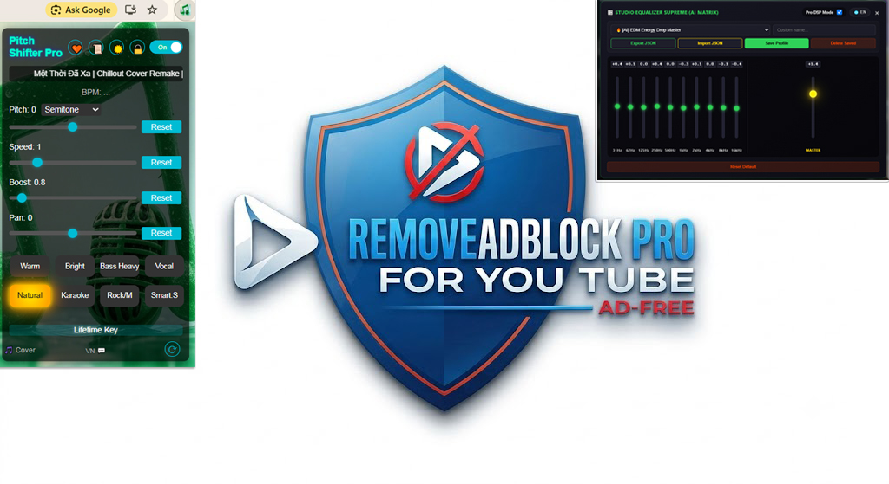

# 🎵 **PITCH SHIFTER PRO V2.607.2071 FINAL**
**Bộ Chuyển Giọng & Xử Lý Âm Thanh Chuyên Nghiệp Cho YouTube**

> Công cụ xử lý âm thanh cao cấp kết hợp **Pitch Shifter**, **Điều khiển tốc độ**, **HiFi Equalizer AI Matrix** và tính năng **Tạo Cover** thông minh.  
> Mang đến trải nghiệm nghe nhạc – karaoke – remix đỉnh cao với chất lượng âm thanh tinh khiết nhờ công nghệ **HiFi AT2030**.

**Tác giả:** Thái Thông

---

### 🎥 Demo trên YouTube

---

## ✨ TÍNH NĂNG NỔI BẬT

- **Pitch Shifter chính xác**: Điều chỉnh cao độ ±12 semitone (hỗ trợ cả chế độ Semitone & Smooth)
- **Điều khiển tốc độ linh hoạt**: Từ 0.25x đến 4x, giữ nguyên cao độ (Time Stretch)
- **HiFi Equalizer AI Matrix**: 8 dải tần chuyên nghiệp + Dynamic EQ thích ứng thời gian thực
- **AI Sound Profiles**: Hơn 10 preset thông minh (Karaoke, EDM, Vocal, Bass Heavy...)
- **Studio Cover Export**: Ghi và tải file `.webm` chất lượng cao với pitch + profile hiện tại
- **Nonstop Protection**: Mô phỏng tương tác người dùng, chống video bị pause đột ngột
- **Giao diện đẹp**: Hỗ trợ tiếng Việt / English, Dark/Light theme, Favorites & lưu Profile
- **Import / Export**: Sao lưu cấu hình JSON dễ dàng

---

## 🧠 CÔNG NGHỆ NỔI BẬT

- **Jungle Audio Engine** – Xử lý âm thanh thời gian thực bằng Web Audio API
- **Adaptive Dynamic EQ** – Tự động điều chỉnh theo phổ âm thanh đang phát
- **AI Sound Optimization** – Phân tích cấu trúc bài hát (verse, chorus, drop...)
- **Stealth Main World Injection** – Tiêm trực tiếp vào Main World, hiệu suất cao
- **Anti-Crash & Memory Safe** – Tối ưu RAM, ổn định kể cả khi ghi cover dài
- **Room Correction Simulation** – Mô phỏng không gian nghe chuyên nghiệp

---

## 🎯 CÁC CHẾ ĐỘ ÂM THANH CAO CẤP

| Chế Độ                  | Đặc Điểm Chính                              | Phù Hợp Với                  |
|-------------------------|---------------------------------------------|------------------------------|
| **Warm**                | Bass sâu, ấm áp, treble dịu nhẹ             | Ballad, Acoustic, Jazz       |
| **Bright**              | Treble sắc nét, chi tiết cao                | Pop, EDM, Dance              |
| **Bass Heavy**          | Bass mạnh mẽ, uy lực                        | EDM, Hip-Hop, Trap           |
| **Vocal**               | Giọng hát nổi bật, rõ lời                   | Karaoke, Ballad, R&B         |
| **Natural**             | Cân bằng hoàn hảo                           | Tất cả thể loại              |
| **Karaoke Dynamic**     | Nhạc nền dịu, giọng hát nổi bật             | Hát karaoke                  |
| **AI Perfect Balance**  | Tự động cân bằng thông minh                 | Nghe nhạc đa thể loại        |
| **AI Karaoke Live**     | Thích ứng theo thời gian thực               | Hát live                     |

---

## 📥 HƯỚNG DẪN CÀI ĐẶT

1. Tải mã nguồn extension về máy và giải nén
2. Mở trình duyệt **Chrome / Edge / Brave**
3. Truy cập `chrome://extensions/` (hoặc `edge://extensions/`)
4. Bật **Developer mode**
5. Nhấn **"Load unpacked"** → Chọn thư mục chứa file `manifest.json`
6. Ghim extension để dễ sử dụng

---
**Link tải nhanh (Google Drive):**  
https://drive.google.com/drive/folders/1PR30_2BOoGzBlmfluM2cpm8rJYRwITF9?usp=sharing

)

---

## 📋 LƯU Ý

- Hoạt động tốt nhất trên **Chrome, Edge và Brave**
- Tính năng Cover và một số AI Preset yêu cầu kích hoạt đầy đủ
- Sau khi YouTube cập nhật lớn, extension có thể cần được cập nhật lại

---

## 🔧 LIÊN HỆ & HỖ TRỢ

- **Tác giả:** Thái Thông  
- **Email:** [ThaiThongsj@gmail.com](mailto:ThaiThongsj@gmail.com)

### 💰 Ủng hộ dự án

**Vietcombank**  
Số tài khoản: `9898661918`  
Chủ tài khoản: **NGUYỄN NGỌC THÁI THÔNG**

---

**Cảm ơn bạn đã sử dụng Pitch Shifter Pro!**  
Chúc bạn có những trải nghiệm âm nhạc tuyệt vời nhất ✨
